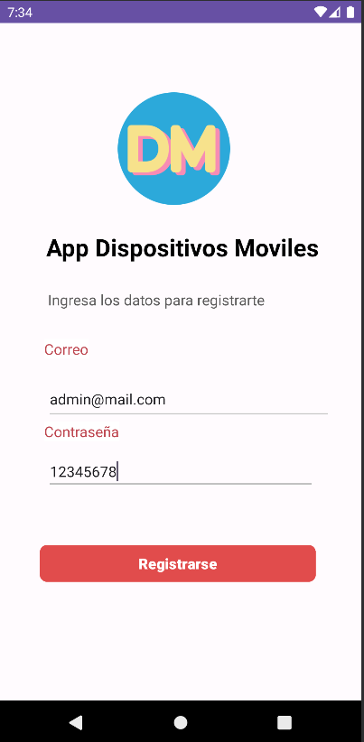
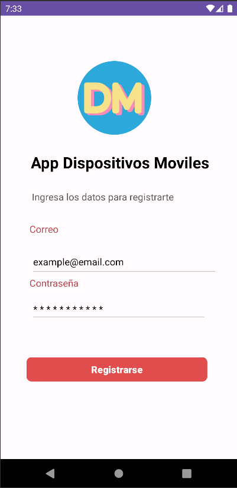

# App Dispositivos Moviles
Proyecto final individual de dispositivos móviles.

## Características

- **Autenticación y Registro:**
   Utiliza Firebase para permitir a los usuarios registrarse y autenticarse en la aplicación utilizando su correo electrónico y contraseña.

- **Visualización de Información de Personajes:**
   Integra la API de Marvel para mostrar información detallada de personajes de Marvel, como nombres, descripciones e imágenes.

- **Información de Anime:**
   Utiliza la API "Jikan" para acceder a datos de anime, como nombres, sinopsis y portada.

- **ViewModel para la Gestión de Datos:**
   Implementa ViewModel para separar la lógica de la interfaz de usuario y administrar los datos de manera eficiente.

- **Autenticación Biométrica:**
   Ofrece autenticación segura utilizando los datos biométricos del dispositivo, como huellas dactilares o credenciales.

- **Base de Datos Interna:**
   Utiliza una base de datos interna para almacenar y gestionar datos localmente en la aplicación.

- **Mejora de Carga con Shimmer:**
   Implementa Shimmer para mejorar la experiencia visual durante la carga de contenido en la interfaz de usuario.

- **Refresco por Deslizamiento:**
   Incorpora SwipeRefreshLayout para permitir a los usuarios actualizar el contenido deslizando hacia abajo en la pantalla.

- **Notificaciones Push con FCM:**
   Utiliza Firebase Cloud Messaging para enviar notificaciones push a los usuarios y mantenerlos informados sobre novedades y actualizaciones.

- **Notificaciones Programadas:**
   Implementa notificaciones programadas utilizando BroadcastReceiver para recordar a los usuarios eventos importantes o tareas pendientes.

- **Uso de Fragmentos:**
   Organiza la interfaz de usuario en fragmentos para crear una experiencia fluida y modular.

- **Búsqueda por Voz a Texto:**
   Permite a los usuarios realizar búsquedas en Google utilizando la función de voz a texto para una experiencia de búsqueda más interactiva.

## Bibliotecas Utilizadas

### Firebase
- `com.google.firebase:firebase-analytics-ktx`: Librería de Firebase para analizar el comportamiento del usuario en la aplicación.
- `com.google.firebase:firebase-auth-ktx`: Librería de Firebase para autenticación.
- `com.google.firebase:firebase-messaging:23.2.1`: Librería de Firebase para implementar notificaciones push en la aplicación.
- 
### Corrutinas
- `org.jetbrains.kotlinx:kotlinx-coroutines-android:1.6.3`: Biblioteca para administrar tareas asíncronas y concurrentes de manera más sencilla y segura en Kotlin.

### Room
- `androidx.room:room-runtime:2.5.0`: Librería para trabajar con bases de datos SQLite de manera más robusta y eficiente utilizando componentes de Android.
- `androidx.room:room-compiler:2.5.0`: Procesador de anotaciones necesario para generar el código necesario para Room.
- `androidx.room:room-ktx:2.5.0`: Extensiones de Kotlin para Room.

### DataStore
- `androidx.datastore:datastore-preferences:1.0.0`: Biblioteca para almacenar datos clave-valor de manera más eficiente y segura.

### Ubicación
- `com.google.android.gms:play-services-location:21.0.1`: Librería de Google Play Services para acceder y gestionar la ubicación del dispositivo.

### Core-KTX
- `androidx.core:core-ktx:1.10.1`: Extensiones de Kotlin para el paquete androidx.core.

### View Model
- `androidx.fragment:fragment-ktx:1.6.1`: Extensiones de Kotlin para fragmentos.
- `androidx.activity:activity-ktx:1.7.2`: Extensiones de Kotlin para actividades.
- `androidx.lifecycle:lifecycle-viewmodel-ktx:2.6.1`: Extensiones de Kotlin para ViewModel.
- `androidx.lifecycle:lifecycle-livedata-ktx:2.6.1`: Extensiones de Kotlin para LiveData.

### Biometric
- `androidx.biometric:biometric-ktx:1.2.0-alpha05`: Librería para implementar autenticación biométrica de manera segura y sencilla.

### Shimmer
- `com.facebook.shimmer:shimmer:0.1.0@aar`: Biblioteca para agregar efectos visuales de brillo a las vistas durante la carga de contenido.

# Resultado
|  |  | |
|----------|:-------------:|:-------------:
|  |  | |

|  |  | |
|----------|:-------------:|:-------------:
|  |  | |

## Uso
1. Ejecuta la aplicación en un emulador o dispositivo Android.
2. Regístrate o inicia sesión con tu cuenta de Firebase.
3. Explora las diferentes características y funcionalidades de la aplicación.

## Instalación

1. Clona este repositorio: `git clone https://github.com/PaulMLP/DispositivosMoviles.git`
2. Abre el proyecto en Android Studio.
3. Configura tu proyecto con tu archivo `google-services.json` de Firebase.
